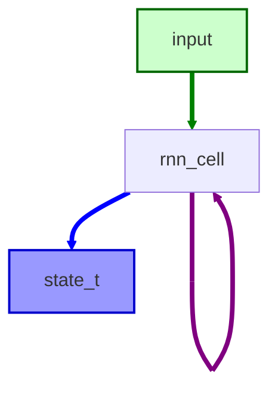
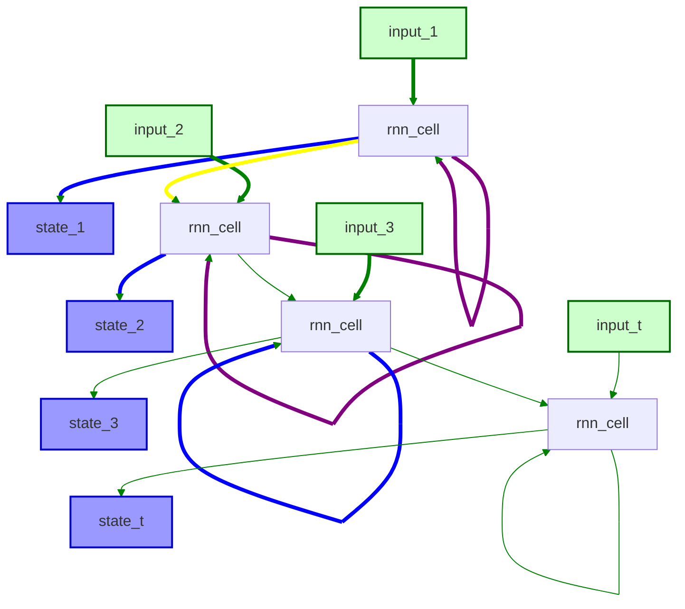

# Basics

The **Transformer** architecture outperformed the recurrent neural networks(RNNS) on machine translations tasks both in quality and costs.

***ULMFiT*** , an effective transfer learning method, showed that training long short-term memory(LSTM) networks on very large and diverse corpus could produce sota classifiers with little labeled data. 

These two advances were the major catalysts for today well-known transformers:

- Generative Pretrained Transformer (**GPT**) 
- Bidirectional Encoder Representation from Transformers (**BERT**)

> By combining the Transformer Architecture with unsupervised these models remove the need to train task-specific architecture from scratch

To understand the Transformers we first need to understand:

- The encoder-decoder framework
- Attention Mechanisms
- Transfer Learning

## The Encoder-Decoder Framework

Before the Transformers, recurrent architectures (LSTM, GRU) were the sota. These architectures contain a feedback loop in the network connections that allows information to propagate from one step to another, making ideal form modeling sequential data, like text.  As

***Unrolled*** 

